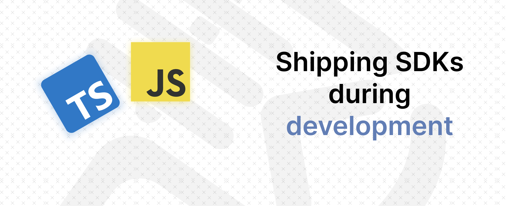

# Shipping JS SDK in the development environment

This repository is a part of the article [Shipping JS SDK in the development environment](https://deepak-kharah.medium.com/shipping-js-sdk-in-the-development-environment-aa0642f03b02). It is a walkthrough of how to ship a JavaScript SDK in the development environment.

## Follow along

1. Clone the repository
2. Install the dependencies
3. Run the development server
4. Open the browser and navigate to `http://localhost:3000`

This repository contains different branches for each step in the article. You can checkout to the branch to see the code at that step.

## License

This project is licensed under the MIT License - see the [LICENSE](LICENSE) file for details.
